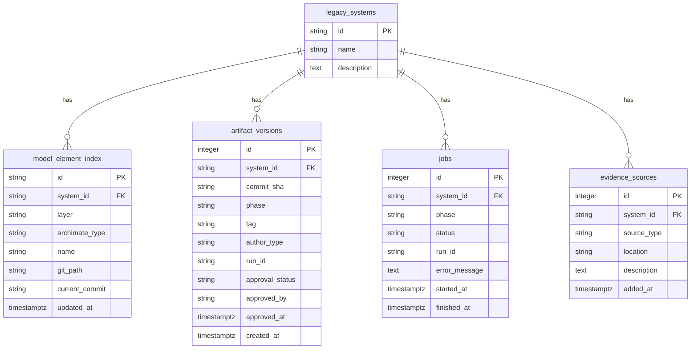

# Database schema

```mermaid
erDiagram
    legacy_systems {
        string id PK
        string name
        text description
    }
    model_element_index {
        string id PK
        string system_id FK
        string layer
        string archimate_type
        string name
        string git_path
        string current_commit
        timestamptz updated_at
    }
    artifact_versions {
        integer id PK
        string system_id FK
        string commit_sha
        string phase
        string tag
        string author_type
        string run_id
        string approval_status
        string approved_by
        timestamptz approved_at
        timestamptz created_at
    }
    jobs {
        integer id PK
        string system_id FK
        string phase
        string status
        string run_id
        text error_message
        timestamptz started_at
        timestamptz finished_at
    }
    evidence_sources {
        integer id PK
        string system_id FK
        string source_type
        string location
        text description
        timestamptz added_at
    }

    legacy_systems ||--o{ model_element_index : has
    legacy_systems ||--o{ artifact_versions : has
    legacy_systems ||--o{ jobs : has
    legacy_systems ||--o{ evidence_sources : has
```
